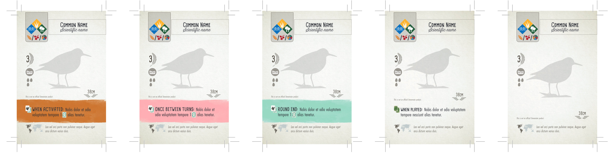

# Wingspan Bird Card Development Kit

This is unofficial Bird Card Development Kit for [Wingspan](https://stonemaiergames.com/games/wingspan), a wonderfully nerdy and birdy boardgame designed by Elizabeth Hargrave and produced by Stonemaier Games. This development kit is made available in the form of a Photoshop file (PSD) and will enable you to design your own bird cards (for personal use, of course). **This is not an official Stonemaier product.**

Before you begin, please read the official [Stonemaier Fan Content Policy](https://www.dropbox.com/sh/f2tekc23yvb27w3/AAAVq1zuMLLiaHFwTtUF9Vp3a/Card%20Frames?dl=0&preview=Stonemaier+Fan+Content+Policy+(Read+First).rtf&subfolder_nav_tracking=1).

 
 

  

 
 

## Requirements

Unfortunately this is where I tell you the bad news. Some of the fonts used on the official Wingspan bird cards are commercial fonts. You must have these fonts installed on your computer for the text on the birds cards to render properly. Fonts don't come cheap, and I'm sad to say the start up costs here are quite hefty. You may still continue without the following paid fonts, but the bird cards might not look right. You can, of course, always substitute any on the fonts below with comparable free alternatives. If you find suitable alternatives, please [share them with me](mailto:hello@nathanbuchar.com) so that I can add them here.

* [Cardenio Modern](https://www.dafont.com/cardenio-modern.font) font (free!)
* [Thirsty Rough](https://www.myfonts.com/fonts/yellow-design/thirsty-rough/) font
* [Futura Condensed](https://www.fonts.com/font/linotype/futura/condensed-family-pack) font
* Photoshop, or you can use https://photopea.com (free!)

## Download

Go [here](https://github.com/nathanbuchar/wingspan-bird-card-dev-kit/releases).

## See Also

* [Columbiformes Wingspan Expansion Pack](https://nathanbuchar.com/wingspan-pigeons) (unofficial)
